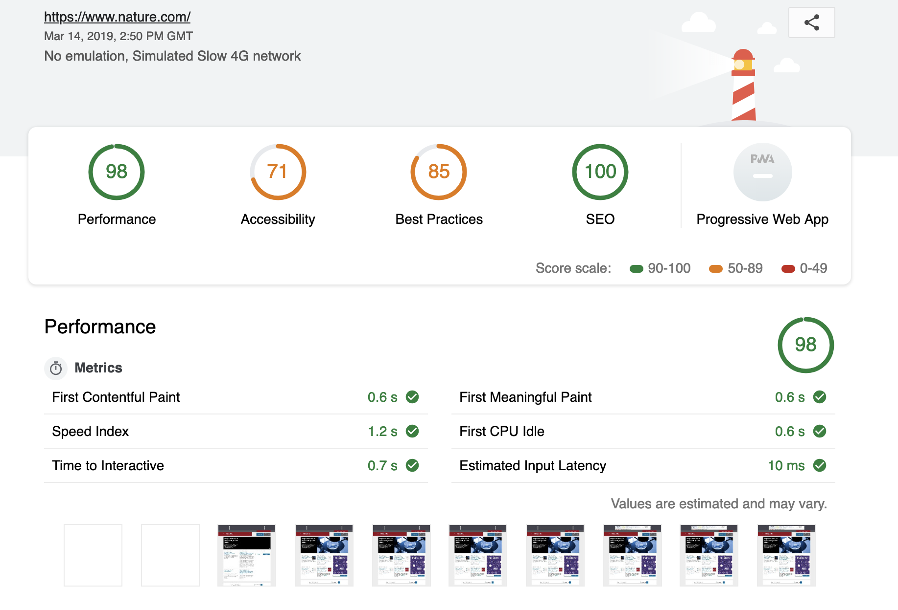

#  Puppeteer and  Lighthouse
Using Google Puppeteer to run Google Lighthouse programmatically within a CI-CD environment and generate reports to measure performance accessibility and security on the fly.



### Two projects
>- [Google Lighthouse Puppeteer](./lighthouse-puppeteer)
> A simple implementation

- [Google Lighthouse Puppeteer multi-page with score analysis and slack alerts](./lighthouse-puppeteer-slack)
Does multi-page lighthouse puppeteer scans with lighthouse score analysis, and slack alerts


### What is Lighthouse?
[Google Lighthouse](https://developers.google.com/web/tools/lighthouse/) is an open-source, automated tool for improving the quality of web pages. You can run it against any web page, public or requiring authentication. It has audits for performance, accessibility, progressive web apps, and more.

### What is Puppeteer?
 Most things that you can do manually in the browser can be done using [Google Puppeteer](https://developers.google.com/web/tools/puppeteer/)! Automate form submission, UI testing, keyboard input, etc. Create an up-to-date, automated testing environment. Run your tests directly in the latest version of Chrome using the latest JavaScript and browser features.

### Setup 
Install node via `brew install node`

### Run
`./build`


### Notes
* Runs only Desktop compatibility tests, to run mobile pass in a different `config` to lighthouse 
``` 
const report = await lighthouse(page.url(), opts, config).then(results => {
    return results;
});
```
* Can be run against different configs by referencing up https://github.com/GoogleChrome/lighthouse/blob/master/docs/configuration.md#more-examples